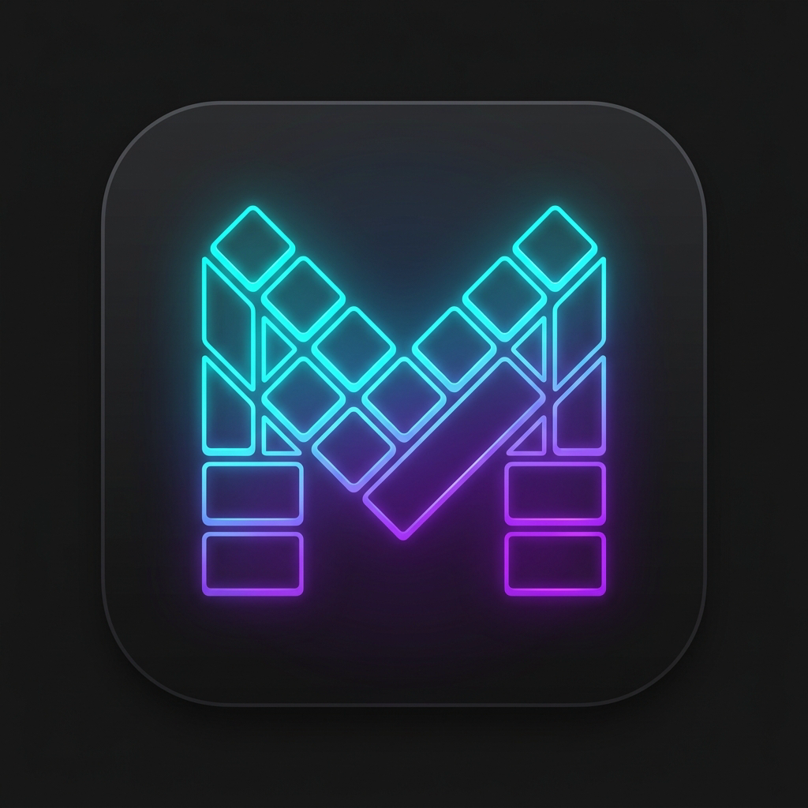

# Metroboard [](https://github.com/Cyanexani/metrokeyboard/actions/workflows/android.yml)

**Metroboard** is the official default keyboard included in **Metro OS**, built as a free, open-source input method for Android 8.0+ devices. Designed to complement Metro OS with sleek Metro-inspired aesthetics, modern user-friendly features, and deep customization, Metroboard operates with complete respect for your privacy. Currently in official **Beta**.

---

## 📥 Downloads & Installation

Pre-compiled release APKs for all hardware architectures are automatically generated via GitHub Actions:

- 📦 **Latest GitHub Releases**: [github.com/Cyanexani/metrokeyboard/releases](https://github.com/Cyanexani/metrokeyboard/releases)

### Supported Architectures
Each release includes build APKs tailored for:
- `arm64-v8a` (Modern 64-bit Android devices)
- `armeabi-v7a` (32-bit ARM devices)
- `x86` & `x86_64` (Emulators & Intel-based Android devices)
- `universal` (Fat APK containing all ABI libraries)

---

## ✨ Highlighted Features

- 🎨 **Metro OS Design System**: Native Metro UI look & feel, dynamic accent themes, and custom styling.
- 📋 **Integrated Clipboard Manager**: History management, pinned items, and fast pasting.
- 🧩 **Extension Support**: Modular language packs, layout extensions, and theme engines.
- 😀 **Emoji & Media Keyboard**: Searchable emoji picker, history, and suggestions.
- 🔒 **Privacy-First**: Zero telemetry, no internet permission requirements for typing, and complete local execution.

---

## 🛠️ Building from Source

Ensure you have Android SDK 35+, NDK 26+, CMake, and JDK 17 installed.

```bash
git clone https://github.com/Cyanexani/metrokeyboard.git
cd metrokeyboard
./gradlew assembleRelease
```

---

## 🤝 Contributing

Contributions to Metroboard are welcome! Please see [CONTRIBUTING.md](CONTRIBUTING.md) for setup instructions and contribution guidelines.

---

## 📜 License

```text
Copyright 2020-2026 The Metroboard Contributors

Licensed under the Apache License, Version 2.0 (the "License");
you may not use this file except in compliance with the License.
You may obtain a copy of the License at

    http://www.apache.org/licenses/LICENSE-2.0

Unless required by applicable law or agreed to in writing, software
distributed under the License is distributed on an "AS IS" BASIS,
WITHOUT WARRANTIES OR CONDITIONS OF ANY KIND, either express or implied.
See the License for the specific language governing permissions and
limitations under the License.
```

Thanks to [The Metroboard Contributors](https://github.com/Cyanexani/metrokeyboard/graphs/contributors) for making this project possible!
